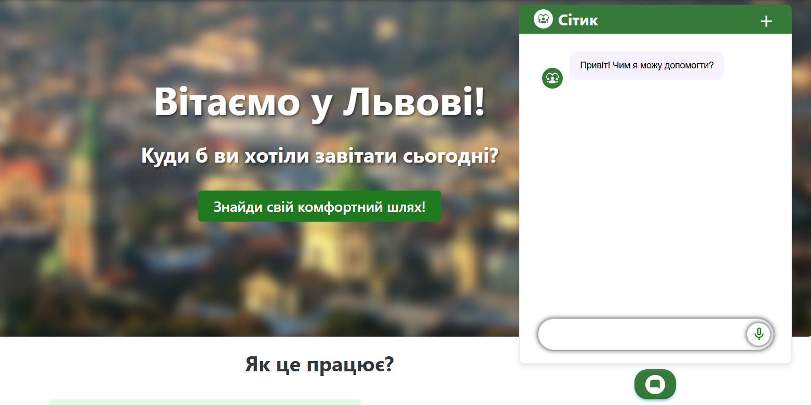
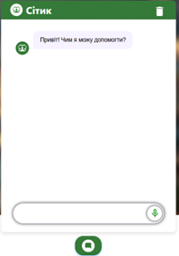
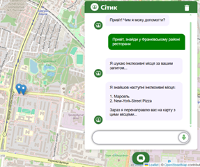
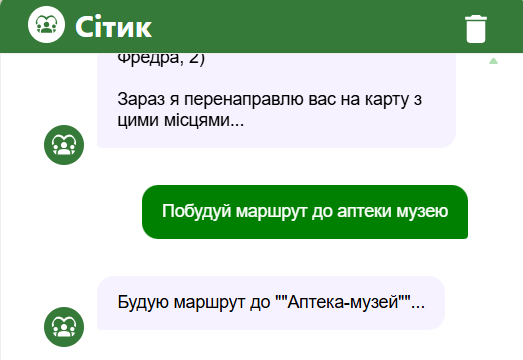
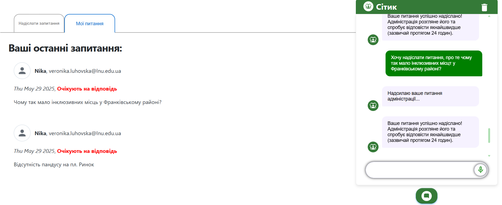
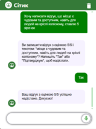
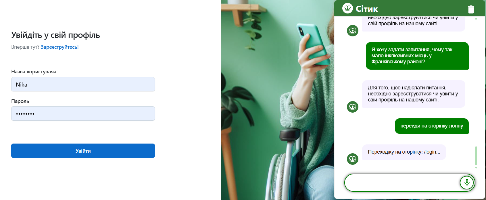
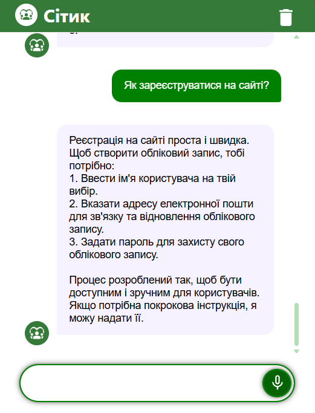

# 👩‍🦽‍➡️ Inclusive City + AI-асистент

**Inclusive City** — веб-сервіс інклюзивного міського простору для людей з обмеженими можливостями.

**AI-асистент** - це інтелектуальна система, створена для взаємодії з користувачем у природній формі (текст або голос), з метою надання корисної інформації і допомоги у користуванні веб-додатком для людей з
особливими потребами.

---

## 👤 Автори

- **ПІБ**: Луговська Вероніка Володимирівна (frontend і AI-помічник) та Куцан Віталій Андрійович (backend)
- **Група**: ФЕІ-42
- **Керівник**: асистент Парубочий Віталій
- **Дата виконання**: 01.06.2025

---

## 📌 Загальна інформація

- **Тип проєкту**: Вебсайт (Frontend + Backend) + AI-помічник
- **Мова програмування**: TypeScript, JavaScript, C#
- **Фреймворки / Бібліотеки**: React, Vite, Redux Toolkit, Material UI, Leaflet, .NET, Docker, MUI

---

## 🧠 Опис функціоналу

- 🔐 Реєстрація та авторизація користувачів
- 🗺️ Інтерактивна карта з пошуком інклюзивних місць (кафе, аптеки, лікарні тощо)
- 📝 Додавання, перегляд та оцінювання місць (відгуки, рейтинги)
- 💬 Голосовий та текстовий чат-асистент для навігації, пошуку місць за критеріями користувача, побудова маршруту до обраних об'єктів, надсилання відгуків, запитань, скарг та консультування
- 📄 Сторінка Q&A для зворотного зв’язку з адміністрацією
- 👩‍💼 Адмін-панель для керування контентом (додавання, видалення, редагування), відповіді на запитання користувачів
- 🌍 Пошук місць за критеріями доступності (пандуси, тактильна плитка, тощо)

---

## 🧱 Опис основних класів / файлів

| Клас / Файл                                   | Призначення                                      |
|-----------------------------------------------|--------------------------------------------------|
| `src/App.tsx`                                 | Головний компонент, маршрутизація                |
| `src/pages/MapPage/MapPage.tsx`               | Сторінка з інтерактивною картою                  |
| `src/pages/InfoPage/InfoPage.tsx`             | Інформаційна сторінка про інклюзивне місце       |
| `src/pages/NavbarAndFooter/ChatPopUp.tsx`     | Реалізація AI-асистента                          |
| `src/pages/RegisterPage/components/SignInPage.tsx` | Сторінка входу користувача                  |
| `src/pages/RegisterPage/components/SignUpPage.tsx` | Сторінка реєстрації користувача             |
| `src/pages/MessagePage/MessagePage.tsx`       | Q&A, зворотній зв’язок                           |
| `src/pages/AdminPage/AdminPage.tsx`           | Адмін-панель                                     |
| `src/app/overpassService.ts`                  | Робота з Overpass API для пошуку місць           |
| `src/app/useTexttoSpeech.tsx`                 | Голосове озвучення відповідей                    |
| `src/app/useSpeechToText.tsx`                 | Розпізнавання голосового запиту                  |
| `src/app/handlers`                 | Папка, містить декілька файлів, які відповідають за обробку спеціальних дій і сценаріїв у чат-боті. Вони реалізують логіку, яка реагує на певні теги, запити або події, що виникають під час взаємодії користувача із системою.                    |

---

## 🚀 Як запустити фронтенд

> ⚠️ Перед запуском переконайтесь, що у вас встановлено **Node.js** та **npm**.

1. 📥 **Склонуйте репозиторій:**

```bash
git clone https://github.com/your-username/inclusive-city.git
cd inclusive-city
```
2. 📦 **Встановіть залежності:**
```bash
npm install
```
3. ⚙️ Створіть .env файл (необхідно для API-ключа до Gemini AI):
```bash
VITE_API_BASE_URL=key
```
4. 🟢 Запустіть застосунок:
```bash
npm run dev
```
5. Відкрийте `http://localhost:5173` у браузері

## 🚀 Як запустити бекенд

## Вимоги

- [.NET 7 SDK](https://dotnet.microsoft.com/en-us/download/dotnet/7.0)
- [Docker](https://www.docker.com/) та [Docker Compose](https://docs.docker.com/compose/)
- (Опціонально) Azure Storage Account для роботи з Blob Storage

## Запуск через Docker Compose

1. Скопіюйте файл `.env.example` у `.env` та вкажіть необхідні змінні оточення.
2. Запустіть команду у корені репозиторію:

    ```sh
    docker-compose up --build
    ```

3. Сервіси будуть доступні на відповідних портах, вказаних у `docker-compose.yaml`.

## Локальний запуск сервісів

1. Перейдіть у папку з рішенням:

    ```sh
    cd Incity
    ```

2. Відкрийте рішення [Incity.sln](Incity/Incity.sln) у Visual Studio або VS Code.

3. Встановіть залежності:

    ```sh
    dotnet restore
    ```

4. Запустіть три сервіси Incity.Services.AuthAPI, Incity.Services.QuestionsAPI, Incity.Services.Gateway наприклад:

    ```sh
    dotnet run --project Incity.Services.AuthAPI/Incity.Services.AuthAPI.csproj
    ```

### Для побудови маршруту стягніть репозиторій за посиланням: 
`https://github.com/ikogarasi/Inclusive-City-Routing`

## 🔌 API приклади

### 🔐 Авторизація

**POST /api/auth/login**

```json
{
  "username": "user",
  "password": "123456"
}
```

**Response:**
```json
{
  "token": "jwt_token_here"
}
```
### 📝 Реєстрація

**POST /api/User/Register**

```json
{
  "userName": "user",
  "email": "user@example.com",
  "password": "123456"
}
```

**Response:**  
HTTP 200 OK (або помилка)

---

### 💬 Надіслати питання адміністрації

**POST /api/User/Question**

```json
{
  "description": "Як додати нове місце?"
}
```

**Response:**

```json
{
  "id": 1,
  "description": "Як додати нове місце?",
  "createdAt": "2024-06-05T12:00:00Z"
}
```

---

### ⭐ Додати відгук

**POST /api/v1/Review**

```json
{
  "osmId": 123,
  "osmType": "node",
  "username": "user",
  "imageBase64": "",
  "createdBy": 1,
  "comment": "Дуже зручно для людей на візках!",
  "rate": 5
}
```

**Response:**

```json
{
  "success": true
}
```

---

### ⭐ Отримати відгуки для місця

**GET /api/v1/Review?osmId=123**

**Response:**

```json
[
  {
    "id": 1,
    "osmId": 123,
    "username": "user",
    "comment": "Дуже зручно для людей на візках!",
    "rate": 5,
    "createdAt": "2024-06-05T12:00:00Z"
  }
]
```
---

## 🖱️ Інструкція для користувача

1. **Головна сторінка** — на головній сторінці присутня інструкція по користуванню, кнопки переходу:
   - `🗺️ Карта` — пошук місць
   - `🔐 Увійти` / `📝 Зареєструватись` — авторизація/реєстрація

2. **Пошук місць**:
   - Виберіть категорію, радіус, натисніть "Пошук"
   - Переглядайте результати на карті, переходьте до деталей
   - Будуйте маршрут до обраного місця

3. **Відгуки та оцінки**:
   - На інформаційній сторінці інклюзивного місця залишайте відгук, ставте оцінку, переглядайте інформацію про заклад та враження від інших користувачів

4. **AI-асистент**:
   - Натисніть іконку чату, ставте питання голосом або текстом. Допомагає людям з інклюзією у користуванні сайтом, навігації і відповідає на питання.

5. **Q&A**:
   - Надсилайте питання/пропозиції адміністрації через відповідну сторінку

---

## 📷 Приклади / скриншоти












---

## 🧪 Проблеми і рішення

| Проблема                    | Рішення                                              |
|----------------------------|------------------------------------------------------|
| Не запускається backend     | Перевірте Docker, порти, змініть налаштування .env   |
| Не працює пошук на карті    | Перевірте підключення до Overpass API                |
| CORS помилка                | Додайте CORS у backend або gateway                   |
| Не зберігаються відгуки     | Перевірте підключення до бази даних                  |

---

## 🧾 Використані джерела / література

- React, Redux, Material UI офіційна документація
- Leaflet.js документація
- .NET documentation
- OSRM i OverPass API документація
- Google Developer API


